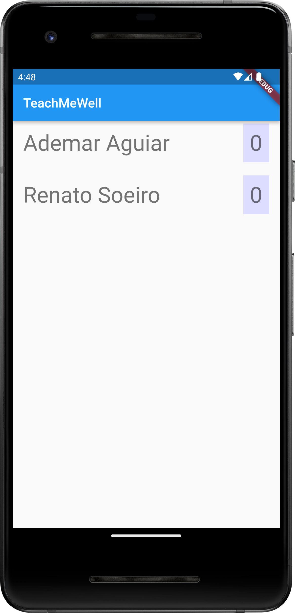
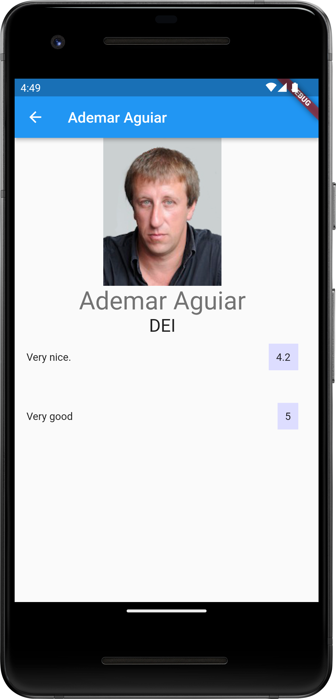

# Architecture and Design

## Logical Architecture

## Physical Architecture

Our application will run on mobile devices which will be connected to our application server, where the business logic services will handle all the 
data in the database. This server will be connected to SIGARRA’s search engine and teacher database, parsing its HTML info and interacting with it almost like an end-user.

## Vertical prototype

We have developed a vertical prototype that allows the user to choose a teacher and see their ratings. At this point, in the home page we have a 
list of all professors in the database, and if we click the name of one of them it opens their profile, with more information about the professor 
and all the comments made about them. The vertical prototype is already connected to Sigarra and Firebase. For now, Sigarra is only used to retrieve 
the photo and the rest of the professors’ information. Their comments are stored in Firestore (a specific Firebase service).

